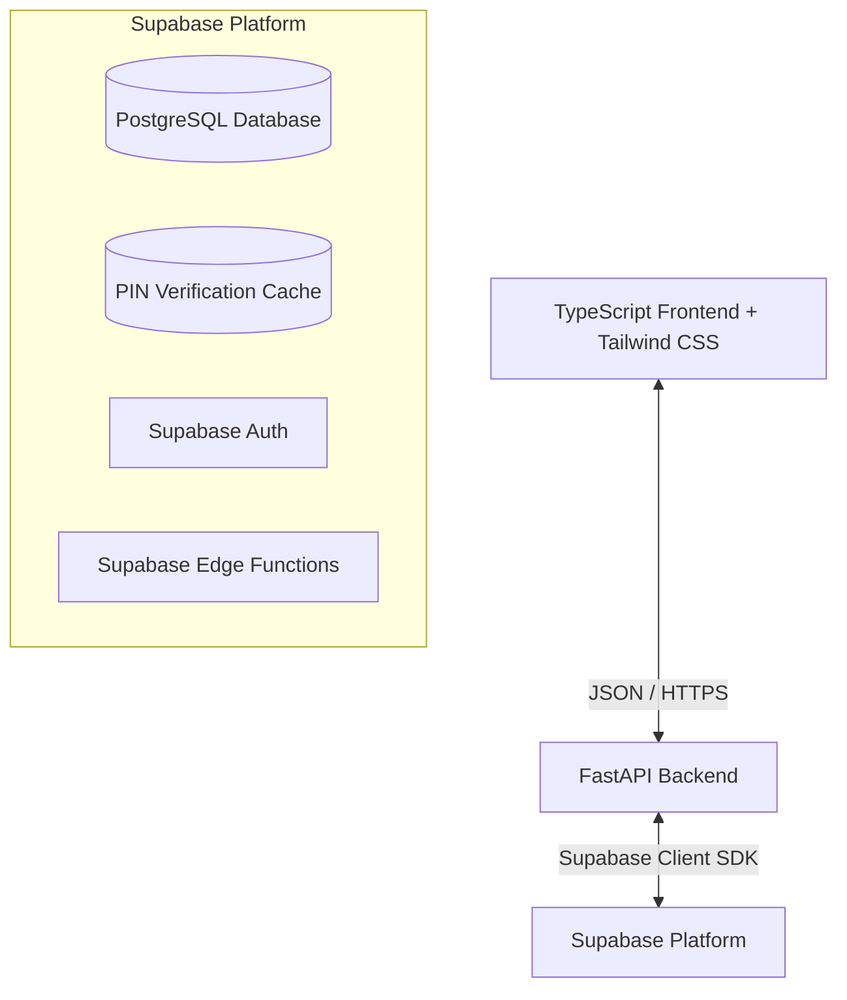

# High-Level Design (HLD) - Carbon Footprint Tracker with Sub-Application Access (Supabase)

## 1. System Architecture
The application uses a FastAPI backend (Python), a Node.js/TypeScript frontend styled with Tailwind CSS, and **Supabase** for database, authentication, and caching.

## 2. Core Modules
- **Authentication Service**: Integrated with Supabase Auth to manage user signups, logins, and sub-app purchases.
- **PIN Verification & Cache**: PIN verification codes are generated securely on Supabase Edge Functions and stored in a temporary, self-expiring PostgreSQL cache table.
- **Carbon Tracking Service**: Logs and aggregates carbon footprints.

## 3. Security Considerations
- **PIN Protection**: PINs are hashed using bcrypt.
- **Access Isolation**: Sub-app data is partitioned by `user_id` and Checked against `pid` purchases.

## 4. Accessibility & Public Pages
When designing public pages, the following are prioritised:
- **SEO & Performance**: Optimized meta tags, semantic HTML structures, and fast page load times.
- **A11y (Accessibility)**: WCAG 2.1 AA compliant color contrasts, ARIA labels, and full keyboard navigability.
- **Responsive Layout**: Designed mobile-first using Tailwind CSS.
